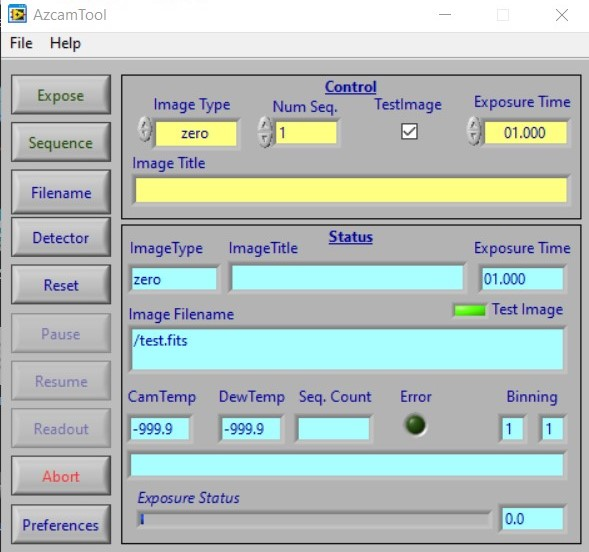

# azcam-tool

This National Instruments LabVIEW program is a GUI frontend to an *azcamserver* application.  It connects to *azcamserver* using the socket interface and controls the acquisition of images.

It is used for laboratory image acquisition as well as astronomical observing.

## Requirements

National Instruments LabVIEW 2014 Run-time Engine is required: http://www.ni.com/en-us/support/downloads/software-products/download.labview.html#306317 or search the [NI](http://www.ni.com) web site.

## Installation

Typically *azcam* software is installed in subfolders of the `/azcam` folder.

* `git clone https://github.com/mplesser/azcam-tool`
or
* Download zip file and unzip to `/azcam/azcam-tool'

## Usage

Execute *azcamtool.exe* in the */builds* folder (Windows OS).

The *azcamtool* GUI connects by default to an *azcamserver* process running on *localhost*. The socket host and port may be changed on the command line.

# Operation

## Main Window

The main window of an AzCamTool is similar to that shown above. Cyan colored fields in the Status area display current status and yellow fields in the upper block are for data entry. CamTemp typically refers to the detector temperature and DewTemp is the colder (LN2) temperature, but the actual sensors and their locations are system dependent. Note that the cyan fields indicate the current camera status and may differ from the last values set in the yellow fields, especially of there are other AzCam operations in progress, such as scripts running in a console window.

An image exposure is made by selecting the ImageType, setting the ExposureTime, and pressing Expose. ImageType is used to set the image type in the image header, to enable comparison lamps for some systems, and to control the shutter during exposure.

Comparison lamps are used when the ImageType is set to a comparison exposure type, as determined by AzCam configuration information. The comp lamps are automatically turned on and off (when the instrument is enabled in Preferences).

If AutoTitle is enabled (Preferences-Image File) then changing ImageType will also update the ImageTitle field to the ImageType string for non-object exposures, and to the last object title entered for object exposure types.

Pressing the Sequence button will immediately start a sequence of N identical exposures as specified by the NumSeq. For a sequence, AutoIncrementSequence in ImageFilename should usually be turned on to increment the image sequence number by one after each exposure. For comparison exposures, a sequence usually turns on the comparison lamps before the sequence starts and turns off the lamps when the sequence finishes (rather than on and off for each exposure). There are sequence parameters accessible from the Preference button.

## Filename

The Filename button opens the Image Filename window above which is used to set the filename, directory, and sequence information. If TestImage is checked in the Image Filename or main window then the image is written to file name test.fits, overwriting any existing test image. The AutoName option names the image file with Rootname and the ImageType of the exposure. If images are not being sent to the local machine, make sure the directory specified exists on the remote machine.

FITS files from multi-amplifier detectors or mosaics may be written in FITS or Multi-Extension FITS (MEF) format. Single amplifier data is normally written as standard FITS files. Images may also be written in raw binary form. The data writing mode is selected in the Filename window by the ImageFormat parameter.

When the system power is turned off, the camera must always be reset using the Reset button once power is turned back on. If problems occur, resetting the controller is often a reasonable fix. Exactly what happens during reset depends on both the system configuration and software parameters such as reset scripts and modes (engineering or user).

## Detector

Pressing the Detector button opens the DetectorParameters window shown above. The row and column numbers are always specified in unbinned pixels. The binning may also be changed on the main window directly.

Multiple amplifier modes in general do not support regions of interest (ROI's), although first and last rows other than the full detector often are acceptable.

## Preferences

Various options may be set in Preferences, activated from the main widow.

An ImageHeaderFile containing image header information may be specified and edited. Keywords in this file are written to the image file exactly as found in the file. Usually a read-only master template file is initially specified, which you may Save-as another name in the editor and then change. It will automatically be loaded when exiting the editor.

AutoTitleImages will create an image title based on the exposure type. When the UseSound is checked a sound will play at the end of each integration if supported by the system in use. The sounds files are snd_exposure_finished.wav and snd_readout_finished.wav.

## Help

Help for specific controls in AzCamTool is available during use. Under the Help menu, the ShowHelpTips and ShowContextHelp may be turned on or off. The context help is a separate window with more detailed help while the help tips are one line explanations of control and indicator functions.

## Display

AzCamTool does not directly support a display tool because it does not receive image data. The DisplayImage flag in Preferences should be checked to tell AzCamServer to display an image which is written locally to disk. This does not affect how an image may be displayed by a remote image server such as dataserver used on UA telescopes. AzCamServer does internally support SAO's ds9 display.